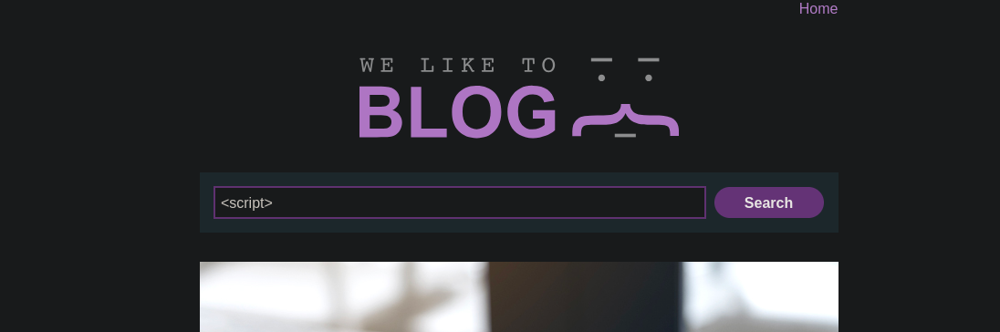

## 1️⃣ معلومات عامة

|العنصر|التفاصيل|
|---|---|
|**رابط اللاب**|[Reflected XSS with some SVG markup allowed](https://portswigger.net/web-security/cross-site-scripting/contexts/lab-some-svg-markup-allowed)|
|**تاريخ الحل**|4 / 5 / 2025|
|**نوع الثغرة**|Reflected Cross-Site Scripting (XSS)|

---

## 🔰 وصف اللاب

اللاب فيه XSS من نوع _Reflected_. الموقع قافل الوسوم المعروفة زي `<script>`، بس سايب شوية وسوم من نوع SVG وبعض الـ events بتاعتها.

المطلوب إنك تنفذ XSS يظهر `alert()`.

---

## 2️⃣ فهم سيناريو اللاب

اول حاجة جربت أكتب `<script>` في خانة البحث، ودي كانت النتيجة:

![[Pasted image 20250504010910.png]]



بعدها ظهرلي إن `<script>` مرفوض:

![[Pasted image 20250504012241.png]]

---

## 3️⃣ اكتشاف العناصر المسموح بها (Tags و Attributes)

بما إن الوسوم المعروفة زي `<script>` محظورة، فبدأت أشوف إيه التاجز (Tags) والـ Attributes اللي الموقع سايبها.  
جربت أستخدم Burp Suite Intruder عشان أعمل اختبار تلقائي بليستة وسوم.

### 🔍 اكتشاف التاجز اللي مش محظورة

جبت ليستة فيها وسوم HTML من XSS Cheat Sheet، وجربت أبعتهم واحد واحد في خانة البحث وشوفت رد السيرفر.

![[Pasted image 20250504012635.png]]

جربت الـ payload ده:

```html
<svg><animatetransform onload=alert(0)></svg
```

فجاتلي الرسالة دي:

![[Pasted image 20250504012756.png]]

بعدها قررت أعمل نفس الخطوة بس أغير الأحداث (events) اللي بستخدمها وشوفت إيه اللي هيشتغل:

![[Pasted image 20250504012831.png]]

ولما جربت الـ payload ده، اشتغل:

```html
<svg><animatetransform onbegin=alert(0)></svg
```

وظهرتلي الرسالة:

![[Pasted image 20250504012931.png]]
